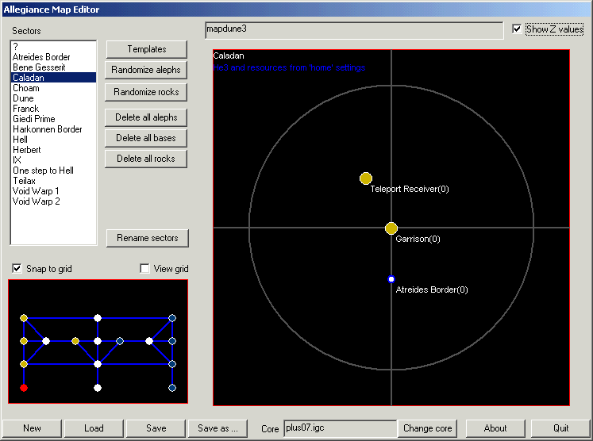

# AME - ALLEGIANCE MAP EDITOR

## A. Installation

### You need to run AME on a computer where Allegiance is installed

Nothing else to install. Just launch "AME.EXE". Keep FreeImage.dll with the .exe

## B. Using AME (new in this release = blue)

The button 'MAP EDITOR' launch the map editor (AME)

Use the **New** button to create a new map from scratch
Use the **Load** button to load an existing one.  
"Save" and "Save as" are obvious.

Map name is displayed on top right line.

AME basics:

* **Sectors creation/deletion/moving/properties editing**  
    **right double-click on mini-map to create a sector**  
    left click a sector in the sectors list or in the mini-map to view its content (big right frame called 'sector view' here after)  
    double-left clic on a sector in the sectors list or in the mini-map to edit its properties (u can **delete it** from there then)  
    use the mini-map (lower left) to move sector (left mouse button drag, right button to cancel while dragging)  
    moving mouse over a sector display its name  
    the mini-map auto-scale so that it doesnt need scrolling. The red frame shows the 'in-game' mini-map scrolling zone. Drag sector off the mini-map (right or top) to up the scale.  
    When grid snap is on, sectors can only be created and dragged to the grid.
* **Alephs creation/deletion/properties editing**  
    right click on a sector in the mini-map and drag the mouse to another sector then release the button to create an aleph (when yellow the line turn green)  
    (aleph are created at random coords (**updated**) )  
    double-clic or right clicking on it and select "properties"  to edit its props (**updated ("no spin" option)**)
    U can delete an aleph by right clicking on it and selecting "delete" (the connection aleph in the other sector is also deleted).  
    Renaming a sector rename all matching alephs  
    Added: 'randomize alephs' in the right-click sector menu  
    The mini-map now use a 'grid snap' of 0.1 and a grid view. (use the 2 toggles to turn on/off these)  
    The sector are now colored by the "team" they belong to (see bases colors below).
* **Bases creation/deletion/properties editing****right click an empty space** in the sector view to bring the menu and select 'add base' (default: garrison of team1).  
    base color **match** the team color (as the game: Team1 = yellow, Team2 = blue, Team3=purple and so on)  
    bring the right click menu to delete a base or all bases in the sector  
    **double-clic** a base to edit its properties  
    Use the 'type' button to display a cascading menu of all base types and select the one (base name will change too but u can edit it after).  
    Also note that the server **doesnt** compute the leader board at start so if a team has more bases (gar or tech) then another , game will display 50%/50% at start until a new base is created (or one is destroyed) while playing.  
* **Rocks** **creation/deletion/properties editing  
    NB:** Once a sector has AT LEAST 1 rock then then server doesnt generate anything in it. If the sector has no rock at all in the map then the server generates asteriods,he3 and resources according to the game settings or the team setting of the sector (neutral or home sector).**right click an empty space** in the sector view to bring the menu and go in 'Add rock' submenu to choose a standard rock type.  
    Use 'Add asteriods Layout' to add many asteriods  at a time. The layout uses the following parameters:  
       Center (CX,CY,CZ), Radius ,Z Variance (ZVar) ,  Number of rocks (nbrocks).  
    Generate nbrocks (using rock templates for size,hp and sig) on a given disc (Center and radius).  
    The rocks are randomly placed within the disc boundaries. If ZVar is 0, all rocks are on the same Z plan (CZ), otherwise they're randomly set above and under the Z plan (CZ) (ie between CZ+ZVaz and CZ-Zvar).  
    All rock are **red dots** **surrounded** by a  color matching their 'abilities' ('features' in rock properties) as in the game (grey for asteriod, white for helium, green for silicon, ...). If a rock has **no abilities** or **more then one** (yes, can be :)) then the surrounding color is **pink**.  
    bring the right click menu to delete a rock or all rocks in the sector  
    **double-clic** a base to edit its properties:  
    the name of the rock is auto upon creation but u can edit it. Check 'hidden' to not see it in the F3 view of the game  
    the icon is the little rock icon showing near the rock and on "right column of the extended mini-map in the game" (icon doesnt not need to match the feature of the rock but its better to do so cause players might went crazy :)) (u can set here 2 new icons that will also show in the game mini-map :))  
    the render is the rendering model of the rock (need help here to set the good 'template' render). **Custom** render are implemented now (partial object lists (bases,ships,missiles,counters only for now))  
    sig and radius are same as for alephs (default is sig = radius / 10)  
    HP = hitpoints (default = radius \*5)  
    HP gauge = display or not the HP gauge of the rock (standard in the game for he3 and tech rocks)  
    Phantom = HP to zero and HP gauge on = the rock (bug in alleg ? :) cant be **destroyed** and can be fly thru (player ships only). But it still cut the line of sight (good place to hide in :))  
    Random spin & orientation for rocks. AGM will fix maps with invalid spin values upon load.  
    Added: 'randomize rocks' in the right-click sector menu  
    the template list set most of the  properties back to one of the standard types of rock (except name & render)
* **Alephs, Bases and Rocks moving**:  
    Use left mouse button to drag object.  
    **Use** **CTRL + Left mouse button to set Z coord of object**.
* Added: global buttons to randomize alephs and rocks positions and to delete objects.
* Added: cut & paste rocks & bases, shortcuts (LMB = left mouse button, RMB = right mouse button):  
      Paste = shift + LMB click  
      Copy = shift + RMB click  
      Delete = ctrl + RMB click
* Added: sector templates with 'apply to' feature
* Added: aleph templates with 'apply to' feature
* Added: rocks templates with 'apply to' feature

* * *

**E. History / Changes**

4/6/2001: BETA 0 release

4/8/2001: BETA 0 FIX 1 release

* fix file dialog on old systems (Win98, NT4)
* retrieve the server path from registry instead

4/9/2001: BETA 1 INTERIM 1 release:

AGM: (game manager)

* minimize window
* **check server status**
* autoload server parameters at start

AME: (map editor)

* bases creation/deletion/properties (**partial**)
* bases displayed with matching 'in game' team color
* bases name displayed
* **click sector on mini-map** to bring sector view
* **auto aleph renaming** (when u rename a sector)
* **cleaned up** aleph properties (spin & orientation)
* **double-clic sector on mini-map** to display sector properties
* go to sector from sector view (**right click on aleph**)
* sectors list **sorted** by name
* **right click on mini-map** to create **new sector** instead of 'new sector' button

4/10/2001: BETA 1 INTERIM 2 release:

AGM:

no changes

AME:

* new map from scratch and save as feature ("new","load","save" and "save as" buttons)
* 1st part of grid in sector view (single cross only)
* "simple" map validity test upon saving
* minimap scale keeps aspect ratio
* minimap have a min scale now (so can create sector on empty map)
* aleph creation turn 'green' when it's valid to release mouse button
* better mini map mouse handling
* still more stuffs figured out, default aleph spin is 0
* default aleph (in game) color is blue now

and lots of bug fixes.

4/11/2001: BETA 1 INTERIM 3 release:

AGM:

no changes

AME:

* fixed: "Save as" overwrite confirm & server files protection
* cleanup: aleph properties, added: directed toward center feature
* fixed: minimap mouse click bugs on empty map
* fixed: invalid uids generated (tech base building crash)
* add: fix invalid uids in map upon load (repair maps)
* better precision with mouse (remove little drag on simple click/double click)
* bigger stations rendering

4/13/2001: BETA 1 INTERIM 4 release:

AGM: (game manager)

* check server's core (standard or belts/rix)
* added = allow empty teams (prevent game ending if a all players of a team drops, might prevent resiging (need to check))
* noodle's icon (gj man)

AME: (map editor)

*  **sector view: right click "popup" menus**
*  **rocks creation/deletion/properties**
*  added confirmation request of deletions
*  added '**no spin**' feature to alephs
*  CTRL key + left hold + mouse up/down for setting the Z coord
*  grid on sector view
*  reverse 'abort dialog'

4/15/2001: BETA 1 INTERIM 5 release:

AGM: (game manager)

*  total max player values & teams entries controlled by # of teams
* min/max players per teams hidden (need more work)

AME: (map editor)

* better randomizer (alephs)
* rock templates in rock properties dialog work fine now
* matched render/icons/name for standard rocks

**4/17/2001: BETA 1 INTERIM 6 release:**

AGM: (game manager)

* "save to file" ,"load to file" and "new" buttons implemented. Need to set default directory.
* check map name length
* limit game name length

AME: (map editor)

* mini-map grid snap of 0.1
* random rock spin & orientation (fix maps upon load too)
* "randomize rocks" and "randomize alephs" menu entries (right click menu on sector view)

**4/22/2001: OPEN BETA 1**

AGM

* bug fixes

AME

* bug fixes
* \* trap 'escape' & 'return' key
* \* 'delete all ...' buttons
* \* 'randomize all ...' buttons
* \* grid & "grid snap" in mini-map

**5/1/2001: RC**

Setup

* 1st try, need Microsoft Installer (WinME/W2K or download it or Office2000 installed)

AGM

* bug fixes

AME

* bug fixes
* copy/paste for bases & rocks (sector view right click menu)
* reduced font size for sector view
* sector template with 'apply to' feature
* rock templates with 'apply to' feature
* aleph template with 'apply to' feature
* display 'sector i
nfos' (# he3 rocks (total he3/max he3), # of diff rocks)
* snap and grid switches
* in-game "scrolling zone" on mini-map grid (red frame)
* display 'sector name' on mouse over in mini-map

**7/3/2001: 1.0 release**

Setup

* removed

AGM

* added DeathMatch option with # goal kills
* added: "N/A" imbalance choice
* added: allow eject pods toggle, Friendly fire and Lives
* added: core selection of the server

AME

* bug fix: Z coords now shown when been set (ctrl+LBM on object)
* Paste = shift + LMB click
* Copy = shift + RMB click
* Delete = ctrl + RMB click
* A rocks layout  option

**7/3/2001: 1.1 release**

General fix: Works with new cores from Allegiance Final update

**2/19/2002: 1.2 release**

* . New game option: prosperity. Set the total of investissement required to win: The values depends of the 'prosperity step' (default is 72000) that is defined in the core (global #12). You cannot set low or med prosperity game from AGM, only the client side settings allow this.
* . build with VS.Net release version (1.1 & below were build with VS.Net beta 2).

**2/24/2002: 1.3 release**

* "Starting money" & "Total money" are now input box instead of drop-down list. Valid values range from 0 to 9 including fractionnal values.
* "Game length" settings: limited time game, set the value in minutes, 0 for unlimited game.

**3/30/2002: 1.4 release**

* New Alephs randomize algorithm with parameters
* View Z coords option for alephs & bases.
* Rename sectors option: load new names from a text file and randomly rename the sectors (samples provided).

**4/30/2002: 1.5 release**

* Handle new server version 1.0.0.4
* Compatibility with previous version (1.0.0.3004) is kept
* Preserve Allsrv32.exe file date/time when setting core so that next server autoupdate doesnt refresh it (and so doesnt reset the core to 'static\_core').

**5/27/2002: 1.6 release**

* Full sector properties exposed. Planet bmp displayed (requires 16bits color display & client artwork, otherwise a red 'no bitmap' image will be displayed).
* Distance to center exposed when moving an object (aleph, base, rock).
* Z coord displayed near object (when using ctrl-click drag)

**7/16/2002: 1.7 release**

* Thorium rock type added

**3/11/2003: 1.8 release**

* AME is now a standalone tool
* fixed base list choices (from core)
* enhanced custom rock model choice (select custom and choose any .mdl file)

**3/12/2003: 1.9 release**

* randomize rocks crash bug fixed
* "inner alephs" (aleph to same sector) creation: left click and drag within empty space in sector wiew
* enhanced custom nebula globe sector model choice (select custom and choose any .mdl file)

**//2003: 1.95 release**

* some fixes regarding bases/core

**8/6/2008: 1.96 release**

* now use freeimage as a dll
* mdl bitmaps previews are available whatever the desktop screen resolution
* added �fixed position� aleph property. If set the aleph position won�t be randomized. This should be supported in Allegiance R5. With R4 or previous, the aleph name will show a leading �\*�
* �fixed position� alephs are shown as black dot with blue border (normal alephs are white dot with blue border)
* aleph default radius set to 100 (was 200) to match server code
* rock default sig set to radius/100 (was radius/10) to server code
* rocj default HP scale to radius to match server code
* He3 rock default helium set to 65  (was radius\*2)
* aleph icon is now displayed and editable (<icon>bmp.mdl). click the bitmap below to refresh it after changing the value. if icon is empty in aleph template then alephs will keep their current icons, if it's set to something then affected alephs with get this new icon.

**12/03/2017: 1.97 release**

* updated to use Steam registry (HKCU - 1.4)

**02/20/2025: 1.98 release**

* built with VS2022
* sector planet bitmap is now customizable (select the last value in the dropdown). not added to sector templates.

Please all bugs report to [www.alleg.net](http://www.alleg.net) in the corresponding board or on Alleg discord.

Kirth Gersen/KGJV [(kgersen@hotmail.com](mailto:(kgersen@hotmail.com))

Thx to Nick Thoman  (NoodleNT) for his cool icon , gj man :)  
Thx to Maurice Spee for the SLA.

And to the many beta-testers and users
